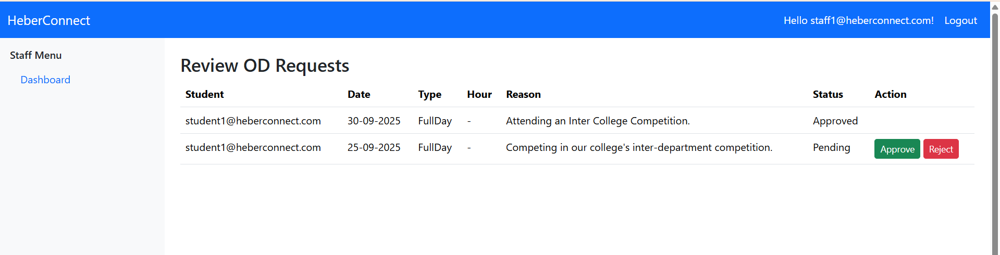

HeberConnect is an in-house college portal that unifies announcements, assignments, leave requests, and complaints, replacing scattered tools. It can expand to support more campus needs over time.

---
As students, we often struggled with fragmented academic communication. Announcements came through WhatsApp groups, assignments were handled through Google Classroom, and OD requests or complaints had to be submitted using paper forms. Because these systems were disconnected, important updates were sometimes missed, and administrative processes became slow and inefficient. These real challenges inspired us to build an in-house unified platform that centralizes communication, academic tasks, and administrative workflows into one accessible system.

## 🌟 Key Features

**Student Features**
- View and submit assignments
- Track upcoming tasks and OD requests
- Receive announcements and notifications
- Submit Complaints

**Staff Features**
- Assign and manage student assignments
- Approve OD requests
- Send announcements to students

**Unified Platform**
- Single solution for multiple manual processes
- Central hub for academic and administrative tasks

---

## 🏗️ Project Structure

```

HeberConnect/
├── Pages/               # Razor Pages for different functionalities
│   ├── Index.cshtml
│   ├── Assignments.cshtml
│   ├── ODRequests.cshtml
│   └── Announcements.cshtml
├── wwwroot/             # Static files
│   ├── css/
│   ├── js/
│   └── images/
├── HeberConnect.csproj
└── README.md

````

---

## 📸 Project Screenshots

  
*Login page for students and staff.*

  
*Student dashboard showing To-Do list of tasks.*

  
*Announcements displayed to students in the dashboard.*

  
*Student dashboard overview.*

  
*Admin reviewing submitted complaints.*

  
*Staff dashboard for reviewing OD requests.*

  
*Staff adding new assignments for students.*

  
*Staff creating announcements.*

  
*Staff dashboard overview.*

  
*Home page of HeberConnect web app.*


## 💻 Technologies Used

* ASP.NET Core 8
* Razor Pages
* Entity Framework Core 

## 📌 Future Improvements
* **Emergency instant notifications** (e.g., urgent campus alerts, blood donation needs)
* **Staff availability status** (to avoid students going back and forth during office hours or break time)
* **Library due-date reminders** and fee payment reminders
* **Event and competition announcements** with open registrations
* **A chatbot** for FAQs and basic support
* **A mobile app version** for even easier access


---

**HeberConnect** — A single hub to manage student assignments,Complaints, OD requests, and announcements seamlessly.
